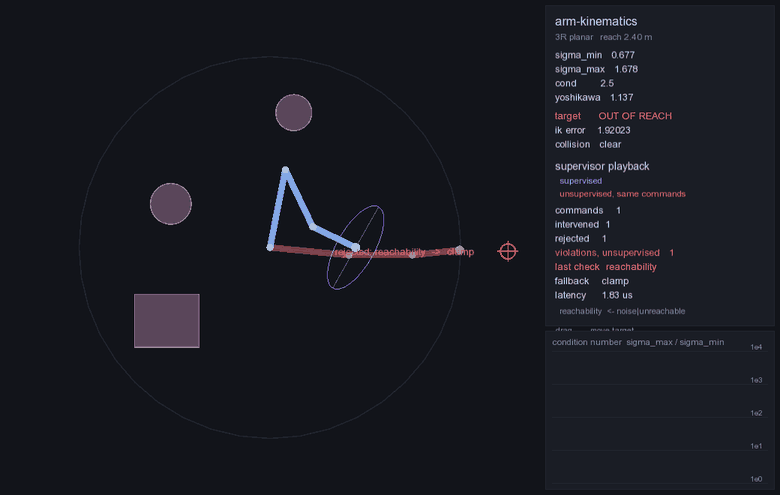
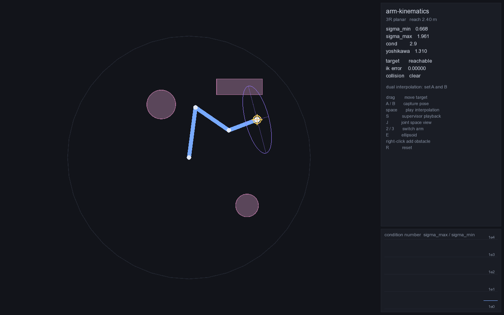
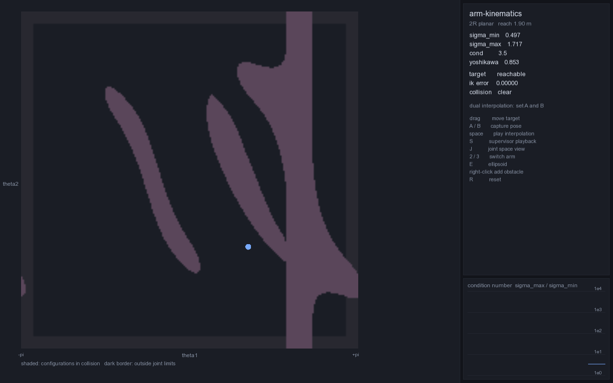
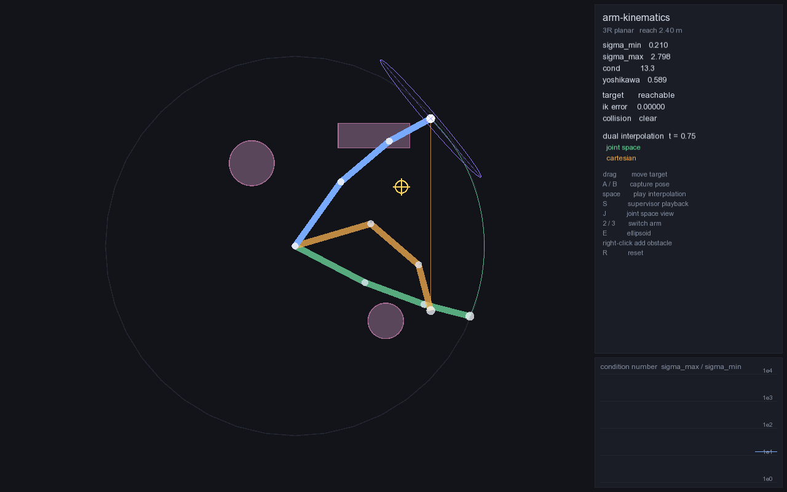

# arm-kinematics

Planar robot arm kinematics in C++17 with a runtime supervisor. Analytic and
damped least-squares IK, manipulability and singularity handling, collision
checking. A deliberately unreliable controller drives the arm; the supervisor
rejects unsafe commands and measures what that costs.



One seeded command stream, two arms. **Blue** runs behind the supervisor;
**red** is the same arm taking the same commands with the guardrail switched
off. The controller is wrong on purpose — noise, targets past the edge of the
workspace, stale setpoints, jumps no actuator could follow, targets sitting
exactly at full extension, and targets on the far side of an obstacle. When a
command is refused, the crosshair turns red and says which check caught it.

## What the guardrail costs

2000 commands, seed 42, 50 Hz. Same command stream in every column.

| Metric | Supervisor off | On, hold | On, clamp | On, plan |
|---|---|---|---|---|
| Joint limit violations | 176 | 0 | 0 | 0 |
| Velocity limit violations | 423 | 0 | 0 | 0 |
| Collisions | 418 | 0 | 0 | 0 |
| Targets reached | 1928 / 2000 | 1238 / 2000 | 1247 / 2000 | 1205 / 2000 |
| Clean targets reached | 1196 / 1196 | 921 / 1196 | 930 / 1196 | 897 / 1196 |
| Intervention rate | 0% | 41.5% | 41.5% | 44.0% |
| p50 supervisor latency | 0 | 4.17 us | 4.58 us | 4.38 us |
| p99 supervisor latency | 0 | 11.13 us | 13.59 us | 2087.46 us |

Which check caught what, under the clamp policy:

| Check | Fired | Rejected |
|---|---|---|
| reachability | 92 | 92 |
| joint limits | 71 | 0 |
| velocity limits | 717 | 0 |
| singularity | 55 | 55 |
| collision | 54 | 54 |

Reproduce with `./build/arm_bench --commands 2000 --markdown bench/results.md`;
every command also lands in `bench_logs/*.jsonl`, one JSON object per line.

**How to read this honestly.**

- *Latency* is the supervisor's own work: the five checks plus whichever
  fallback ran. The IK solve is excluded because the arm does it either way.
  Release build, single thread, Apple Silicon. The 2 ms p99 under the plan
  policy is the RRT, and it is the reason a sampling based planner is a poor
  choice for the inner loop of a 50 Hz controller.
- A check can fire without rejecting. Joint limits fire when the numerical
  solver walks into an illegal branch and the supervisor switches to a legal
  one; velocity limits fire when a step is scaled down instead of refused.
  Only reachability, singularity and collision end in a rejection here.
- *Targets reached* drops under supervision, and it should: 201 of the 2000
  targets were unreachable, singular, or needed a link driven through an
  obstacle. The rest of the gap is the rate limit — after each refused command
  the arm is behind, and 3 rad/s takes a few cycles to catch up. The
  unsupervised arm reaches more targets precisely because it ignores that
  limit and teleports.
- *Clean targets* are the commands carrying no fault worse than sensor noise.
- Hold and clamp differ only in what happens after a rejection; both scale an
  over-fast step rather than refusing it, which is why their numbers are close.

## The three layers

### 1. Kinematics core

Headless, no dependency on the renderer, `include/arm/`.

- **Forward kinematics** returns every intermediate frame, not just the tip,
  because the renderer and the Jacobian both need them.
- **Jacobian**, analytic rather than finite differenced. For a planar revolute
  chain, column *i* is the joint axis crossed with the vector from joint *i* to
  the end effector, which in 2D collapses to `[-(y_ee - y_i), (x_ee - x_i), 1]`.
  Checked against central differences over random configurations.
- **Analytic IK**, closed form for 2R and for 3R with a specified end effector
  heading. Law of cosines for the elbow, `atan2` for the shoulder. Two
  solutions inside the annulus, one at either boundary, none outside it. All
  branches are returned; picking one is the caller's job.
- **Damped least squares**, the load bearing line of the whole project:

  ```
  dq = J^T (J J^T + lambda^2 I)^-1 e
  ```

  `lambda = 0` is the plain pseudoinverse, and it blows up near a singularity
  where `J J^T` is nearly rank deficient. The damping is adaptive: negligible
  in the well conditioned interior, ramped up as `sigma_min` drops below a
  threshold, so the step stays bounded through a singularity instead of
  diverging. Point it at a target beyond the reach and the arm stalls at full
  extension rather than flying apart.
- **Manipulability**: singular values of J, Yoshikawa's `sqrt(det(J J^T))`, the
  condition number, and the ellipsoid axes for the overlay.
- **Collision**: links as capsules, obstacles as circles and axis aligned
  boxes, self-collision between non-adjacent links, and swept path checking
  rather than endpoint checking.

Tests: FK-then-IK round trips over random reachable targets, analytic against
numerical, and the singular, unreachable and boundary cases.

### 2. Visualizer

SFML 3. The app links the library; the library never links the app, which is
what lets the benchmark run headless.

| Workspace | Joint space |
|---|---|
|  |  |

Drag to move the target and watch IK solve live, with the manipulability
ellipsoid at the end effector and the condition number plotted over time. `J`
switches to the joint space view of a 2R arm, where the C-space obstacles are
the shaded bands.

**The dual interpolation demo.** Two ghost arms travel between the same pair of
poses, one interpolating in joint space and one along a straight Cartesian line
with IK solved at every step:



Green is smooth in *q* and curved in the workspace. Orange is a straight line
in the workspace and says so the moment it stops tracking its commanded point.

Keys: drag to move the target, `A`/`B` capture poses, `space` plays the
interpolation, `S` plays the supervisor scenario back, `J` toggles joint space,
`2`/`3` switch arms, `E` toggles the ellipsoid, right-click drops an obstacle,
`R` resets.

### 3. Supervisor

Sits between the controller and the arm. Every command is forwarded, modified,
or rejected. Checks run cheapest first:

1. **Reachability** — inside the annulus, and not inside an obstacle.
2. **Joint limits** — across every closed form branch, because elbow-down may
   be legal where elbow-up is not. For a redundant 3R the end effector heading
   is swept and the closed form solved at each sample.
3. **Velocity limits** — the step is scaled down, or refused, by policy.
4. **Singularity guard** — `sigma_min` at the *commanded* configuration, not at
   whatever this cycle's scaled-down step happens to reach.
5. **Collision** — over the swept path, discretized, not just the endpoint.

On rejection, one of three fallbacks: hold position, clamp to the furthest
feasible point along the commanded step, or plan around it with an RRT on the
joint space of the 3R arm.

Every command produces one JSON line: the target, which faults the controller
injected, which checks fired, which one rejected, which fallback ran, the
supervisor's latency, and what the arm actually did afterwards — measured
independently of what the supervisor believed.

## Build

Needs a C++17 compiler, CMake 3.16+, and Eigen. Catch2 is fetched by CMake.
The visualizer additionally needs SFML 3 and is off by default.

```bash
brew install eigen sfml            # or your platform's equivalent
cmake -S . -B build -DARM_BUILD_VIZ=ON
cmake --build build -j
```

```bash
./build/arm_tests                  # unit tests
./build/arm_bench --commands 2000  # the table above
./build/viz/arm_viz                # the interactive app
./build/viz/arm_viz --supervisor   # supervisor playback
```

The app also renders offscreen, which is how the images above are made and how
it can be checked without a window:

```bash
./build/viz/arm_viz --screenshot out.png --demo 0.75
./scripts/make_media.sh            # regenerates docs/ and bench/results.md
```

## Layout

```
include/arm/   kinematics, ik, collision, rrt, controller, supervisor, scenario
src/           their implementations
viz/           SFML app: scene (no renderer dependency), render, main
bench/         the measurement harness and its output
tests/         Catch2
scripts/       media generation for the README
```

`scenario.hpp` holds the arm, the world and the controller settings that the
benchmark measures, so the table, the tests and the recording all describe the
same system rather than three lookalikes.

## Known limits

- The singularity guard refuses near singular targets outright. It does not
  attempt to escape a singularity the arm is already sitting in; under the
  clamp policy the arm can only creep back out along a feasible direction.
- The RRT replans from scratch on every rejection, which is why its p99 is
  three orders of magnitude above the other policies. Caching a plan across
  commands would be the obvious next step.
- The C-space view is 2R only. For the 3R arm it would need a third axis.
- Obstacles are static. Nothing here handles a moving scene.
